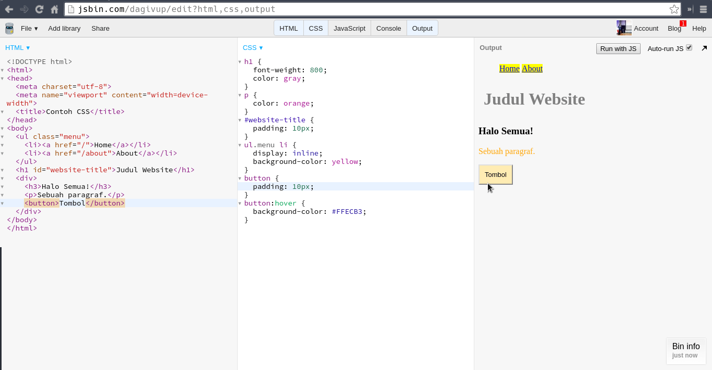
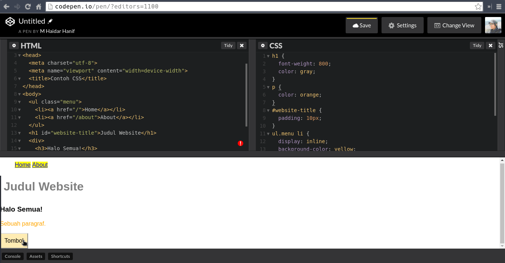
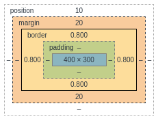

# Basics of Cascading Style Sheet (CSS)

## Objectives

- ▢ Mengulas dasar-dasar CSS.

## Learnings

CSS secara harfiah berarti Lembar Penggayaan yang Mengalir ke Bawah. Oke, ternyata jika diterjemahkan malah membingungkan, mari hanya pedulikan bahasa Inggrisnya. CSS merupakan bahasa style sheet yang berguna untuk membantu menyajikan dokumen yang ditulis dengan HTML maupun XML bahkan SVG. CSS mengatur bagaimana elemen-elemen seharusnya ditampilkan di layar, di kertas, dan berbagai media lainnya. Hal-hal seperti warna, ukuan, posisi, dll (color, size, position, etc) dapat diatur oleh CSS. Tentu saja berarti CSS membutuhkan HTML agar dapat bekerja. Saat ini versi terbarunya adalah versi 3, secara resmi disebut CSS3.

Sintaks atau cara penulisan CSS biasanya terlihat seperti ini:

```css
h1 {
  font-weight: 800;
  color: gray;
}
p {
  color: orange;
}
#website-title {
  padding: 10px;
}
.menu {
  margin: 5em;
}
button:hover {
  background-color: #FFECB3;
}
```

yang akan menghasilkan halaman web bisa ditampilkan seperti ini jika di JSBin:



atau seperti ini jika di CodePen:



Dikarenakan bahasan CSS juga sangat banyak sekali layaknya HTML, di sini kita hanya membahas sepintas hal-hal yang penting. Sehingga tujuannya mengenalkan seperlunya agar kamu dapat familiar. Silakan lihat [berbagai referensi di bawah](#guides) untuk belajar lebih lanjut.

### Menyertakan CSS untuk HTML

Ada 4 metode utama untuk menyertakan CSS agar dapat mengubah layout HTML.

(1) Embed dalam dokumen HTML

```html
<style type="text/css" media="screen">
selector { property: value; }
</style>
```

(2) Link ke file CSS terpisah. Dengan cara menaruh meta data berikut di head HTML.

```html
<link href="mystyles.css" rel="stylesheet" type="text/css" media="screen">
```

(3) Inline CSS pada elemen/tag HTML

```html
<tag style="color:orange; background:yellow;">isi tag</tag>
```

(4) Import CSS dalam file CSS, misalnya di dalam `mainfile.css`

```css
@import "otherfile.css";
```

### Pemilih Elemen (Selector)

Setiap elemen HTML yang ada di halaman web dapat dimodifikasi ataupun dihias dengan CSS. Selector menunjuk elemen apa yang ada di HTML untuk diterapkan style/modifikasinya (seperti warna, ukuran, posisi). Selector dapat merupakan satu atau kombinasi syarat (qualifiers) untuk memilih elemen yang unik, tergantung spesifikasi yang kita tulis.

Bentuk umum selector seperti berikut:

```css
selector { property: value; /* properti lainnya */ }
```

Terdapat perbedaan cara seleksi antara:

- semua paragraf yang ada di halaman web
- suatu paragraf yang ada di dalam `div`

```css
/* semua paragraf */
p {
  color: orange;
}
/* paragraf di dalam div */
div p {
  background-color: coral;
}
```

Selector juga biasanya menunjuk nilai atribut (attribute value) seperti `id` atau `class` ataupun tipe elemen seperti `<h1>` atau `<p>`. Setelah menunjuk atribut atau elemen, terdapat definisi yang menggunakan kurung keriting (curly bracket) seperti `{ }` yang berisi style/modifikasi yang ingin dilakukan terhadap atribut atau elemen yang dituju.

Misalkan ada elemen HTML seperti berikut:

```html

```

Maka kita dapat mendefinisikan CSS selector seperti berikut:

```css
img {
  width: 100px;
}
#logo {
  background-color: white;
}
.gambar {
  border: 1px solid black;
}
.gambar.kecil {
  width: 50px;
}
```

### Properti (Properties)

Setelah elemen dipilih, properti dari style yang tersedia dapat diterapkan pada elemen tersebut. Nama properti diikuti dengan tanda titik dua (colon) (`:`) diikuti dengan nilai/value yang ditutup dengan titik koma (`;`).

Ada beberapa properti umum yang bisa digunakan seperti:

- `color`
- `background`
- `font-size`
- `height` and `weight`

### Komentar (Comments)

Kita bisa menambahkan komentar jika perlu.

```css
/* Komentar atau penjelasan */
selector { property: value; } /* Komentar lain */
```

### Box Model dan Posisi (Positioning)

Sekarang, bagaimana cara elemen-elemen ditampilkan pada halaman dan diatur ukuran serta posisinya? Untuk itu kita perlu mengetahui box model. Juga ingat kembali tentang adanya level penempatan elemen, antara `block` atau `inline` yang mana setiap elemen memiliki value default tersebut pada properti `display`. Ada berbagai value lain seperti `inline-block`, `float`, `absolute`, `relative`, `fixed`, dan `none`.

Value display diatur seperti berikut:

```css
p {
  display: inline-block;
}
```

`inline-block` berarti bersifat seperti elemen level `block`, punya berbagai properti box model, namun tetap ditampilkan sebaris (inline) dengan elemen lain, tidak memulai baris baru.

Sehubungan dengan box model, umpamakan setiap elemen HTML seperti kotak yang memiliki beberapa lapisan jarak (`padding`), batas (`border`), pinggiran (`margin`), dan posisi (`position`); diilustrasikan seperti ini, yang bahkan kamu bisa lihat dengan membuka Chrome Dev Tools.



### Transisi (Transitions)

Transition memungkinkan kita untuk mengubah value properti dengan halus dalam durasi tertentu, jika terdapat kondisi yang berubah misalnya dari static/non-hover (`selector` biasa) kemudian di-hover dengan mouse (`selector:hover`).

Misalnya mengubah ukuran font heading jika di-hover:

```css
h1 {
  font-size: 20px;
  transition: all 1s;
}
h1:hover {
  font-size: 30px;
}
```

Jika tanpa property `transition`, maka perubahan akan terlihat sangat tiba-tiba.

### Transformasi (Transforms)

Transform memungkinkan kita untuk mengubah bentuk atau orientasi elemen seperti `scale`, `rotate`, `translate`, `skew`. Hal ini juga dapat dikombinasikan dengan transition.

```css
h1 {
  transition: all 1s;
}
h1:hover {
  transform: scale(1,2) skew(-15deg);
}
```

### Animasi (Animation)

Dengan animation kita bisa menspesifikasikan beberapa keyframe (bingkai kunci) yang menjadi titik utama animasi. Yaitu style-style apa saja yang akan diatur pada waktu tertentu.

```css
@keyframes resize {
  0% { padding: 0; }
  50% { padding: 0 10px; }
  100% { padding: 0 30px; }
}
h1 {
  animation: resize 1s alternate infinite ease-in-out;
}
```

## References

**Basics**

- [CSS Tutorials, by TutorialsPoint](http://tutorialspoint.com/css)
- [Getting started with CSS, by Mozilla](https://developer.mozilla.org/en-US/docs/Web/Guide/CSS/Getting_started)
- [Introduction to CSS, by CSS Basics](http://cssbasics.com/introduction-to-css)
- [Learn to Code HTML & CSS, by Shay How](http://learn.shayhowe.com/html-css/getting-to-know-css) (lesson 3 to 9)
- [Learn to Code Advanced HTML & CSS, by Shay Howe](http://learn.shayhowe.com/advanced-html-css/detailed-css-positioning) (lesson 2 and 3)
- [Meet the Pseudo Class Selectors, on CSS Tricks](https://css-tricks.com/pseudo-class-selectors)
- [How To Use CSS3 Pseudo-Classes, by Richard Shepherd on Smashing Magazine](https://www.smashingmagazine.com/2011/03/how-to-use-css3-pseudo-classes)
- [Decoupling HTML From CSS, by Jonathan Snook on Smashing Magazine](https://www.smashingmagazine.com/2012/04/decoupling-html-from-css)
- [Belajar CSS dari dasar, oleh Sekolah Koding](http://www.sekolahkoding.com/kelas/belajar-css-dari-dasar)
- [Belajar CSS3, oleh Sekolah Koding](http://www.sekolahkoding.com/kelas/belajar-css3)
