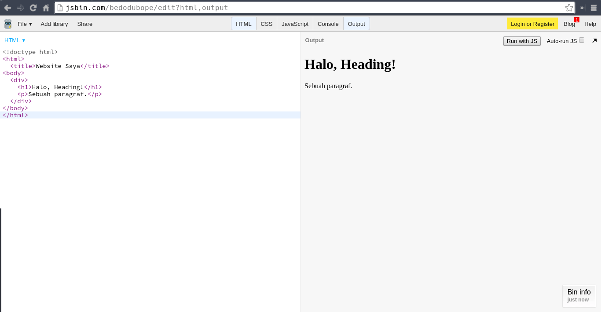
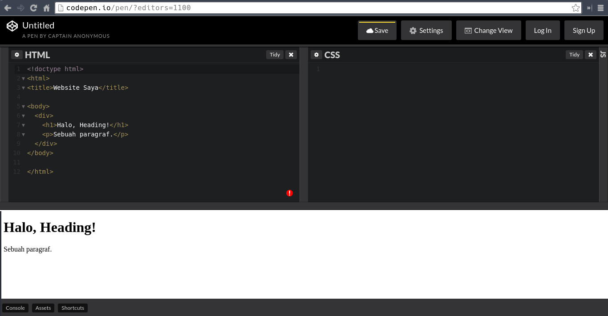
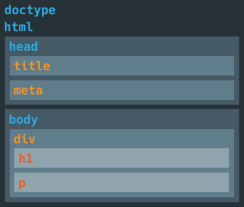
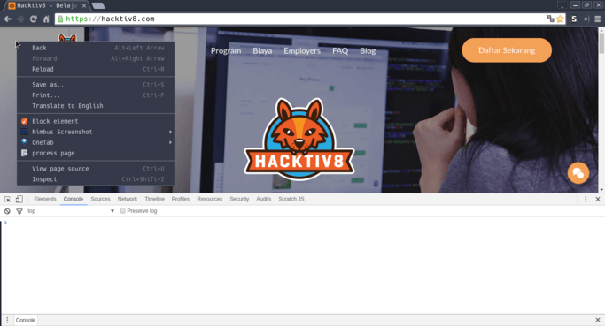

# Learn the Basics of HyperText Markup Language (HTML)

## Objectives

- ▢ Mengulas dasar-dasar HTML.

## Learnings

HTML adalah satu dari banyak bahasa markup yang menjadi bagian pembangun dasar sebuah halaman web (webpage). Saat ini versi terbarunya adalah versi 5.1, secara resmi disebut HTML5. Digunakan untuk membuat dan merepresentasikan secara visual sebuah webpage. HTML menentukan konten dari sebuah webpage, namun bukan fungsionalitasnya. Untuk mengetahui hubungan antara HTML, CSS, dan JavaScript dalam pembuatan website:

- HTML adalah struktur penglihatan (view structure): header, paragraf, tombol, dll (heading, paragraph, button, etc)
- CSS adalah gaya presentasi (presentational style): warna, ukuan, posisi, dll (color, size, position, etc)
- JavaScript adalah sifat fungsionalnya (functional behavior): klik, masukan, perhitungan, dll (click, input, calculation, etc)

Perlu diingat bahwa hanya mengetahui HTML dan CSS belum menjadikan kita sebagai programmer --karena HTML dan CSS bukan bahasa pemrograman-- melainkan hanya seorang coder atau developer yang dapat membuat dan mendesain website. Kita perlu bahasa pemrograman seperti JavaScript untuk menjadi programmer, dan ketiga-tiganya untuk menjadi web developer.

_HyperText_ itu sendiri maksudnya adalah link (dalam hyperlink) yang menghubungkan berbagai halaman web satu sama lain, yang menjadikan World Wide Web (WWW) itu ada. Saat kita membuat dokumen HTML, sama saja membuat halaman web. Halaman web dapat diunggah (uploaded), dikirim (pushed), atau di-deploy ke server ataupun Internet.

HTML mudah dipelajari karena hanya sebuah markup, memungkinkan kita untuk membuat website statis maupun dinamis. Dengan sintaks HTML juga, kita bisa mendeskripsikan apa-apa saja yang ada dalam sebuah website secara semantik (atau memiliki arti), dari konten yang ada di website tersebut. Kita sepertinya juga sudah tau bahwa apapun yang terlihat di browser ditentukan menggunakan HTML.

Sintaks atau cara penulisan HTML biasanya terlihat seperti ini:

```html
<!doctype html>
<html>
  <title>Website Saya</title>
<body>
  <div>
    <h1>Halo, Heading!</h1>
    <p>Sebuah paragraf.</p>
  </div>
</body>
</html>
```

yang akan menghasilkan halaman web seperti ini jika di JSBin:



atau seperti ini jika di CodePen:



Cobalah untuk mengetikkan contoh kode tersebut di dalam JSBin atau CodePen. Lihatlah secara langsung hasilnya di situ. Berikutnya kami akan menunjukkan hasilnya yang dihasilkan di JSBin saja.

Sebagai pengetahuan umum, istilah sintaks merupakan kosa kata (vocabulary) dan tata bahasa (grammar) dari sebuah bahasa komputer, markup, dan pemrograman. Sama saja dengan kata-kata dan perintah-perintah ataupun instruksi untuk disusun sebagai sebuah hasil tertentu yang biasanya merupakan program aplikasi. Kita menggunakan sintaks tertentu untuk membuat pernyataan (statement) program, instruksi untuk bisa dieksekusi oleh browser, compiler, atau interpreter.

Kembali ke HTML, biasanya setiap dokumen HTML yang bagus dan valid memiliki dua bagian utama berikut:

- Head dan Meta Data (bagian kepala HTML dan meta data)
- Body Sections (bagian-bagian badan HTML)

### Elemen Dasar dengan Tag dan Atribut (Tags dan Attributes)

Dokumen atau konten HTML dalam sebuah halaman web dideskripsikan dengan elemen HTML atau tag seperti `head`, `title`, `body`, `article`, `section`, `p`, `div`, `span`, `img`, `picture`, dan banyak lainnya. Elemen-elemen ini membentuk bagian pembangun (building blocks) sebuah website. Website dapat memiliki sedikit atau banyak dari elemen-elemen tersebut.

Tag HTML merupakan kata kunci (keywords) atau nama-nama tag (tag names), yang biasanya dikurung dengan tanda kurung siku (angle brackets) seperti `tagname>sebuah isi atau teks</tagname`. Kebanyakan tag HTML biasanya berpasangan seperti `div` dan `/div`, tapi beberapa tidak seperti `br`. Tag pertama biasanya disebut tag awal atau pembuka, lalu tag kedua disebut tag akhir atau penutup. Tag penutup ditulis seperti tag pembuka, tapi disertakan tanda garis miring depan (forward slash) sebelum nama tag-nya.

Dari contoh sebelumnya, beberapa teks terdapat di antara tag pembuka dan penutup:

- `!doctype html` menentukan tipe file/dokumen menjadi HTML
- `html` dan `/html` menyatakan dokumen HTML, yang berisi:
  - `head` dan `/head` memuat meta data/information, yang berisi:
    - `title` dan `/title`, judul dokumen
    - `meta`, data dan informasi tentang halaman ini
  - `body` dan `/body` akan menunjukkan konten halaman, yang berisi:
    - `div` dan `/div` adalah pembagi (divider) atau wadah (container), yang berisi:
      - `h1` dan `/h1`, heading atau judul artikel misalnya
      - `p` dan `/p`, paragraf teks

Inilah ilustrasi atau visualisasi yang HTML strukturkan:



Kita bisa menggabungkan atau mengumpulkan berbagai tag HTML yang berbeda di dalam satu sama lain. Dalam HTML, penyusunan tag sangat fleksibel.

```html
<div>
  <div>
    <p>
      <em>Hello!<em> Welcome to this website.
    </p>
  </div>
</div>
```

Hati-hati untuk selalu menutup tag jika dibutuhkan, jangan sampai tumpang tindih satu sama lain. Berikut adalah contoh yang salah atau invalid.

```html
<h1><b>Bold Heading</h1>
<h1><b>Bold Heading</h1></b>
```

Beberapa tag HTML dapat memiliki atribut, seperti `href`, `src`, `alt`, dll:

```html
<a href="http://google.com">Google Homepage</a>

```

Ada cara lain untuk melihat berbagai contoh yang ada di berbagai website. Kita dapat melihat sumber halaman (page source) dari sebuah website (coba kunjungi http://hacktiv8.com misalnya), lalu klik kanan halaman tersebut, biasanya bekerja baik di area yang kosong (white space) atau bukan sebuah elemen HTML, lalu pilih "View page source"; atau bisa juga menggunakan shortcut `Ctrl+U`. Cara lain yang lebih lanjut juga dapat menggunakan "Inspect Element" (`Ctrl+Shift+I`) pada elemen apapun di layar.



Untuk melatih kemampuan menulis HTML, cobalah gunakan JSBin atau CodePen sambil mendaftar sebuah akun, agar progress dapat disimpan secara online, bahkan juga dapat dibagikan ke siapapun.

Dikarenakan juga bahasan HTML sangat banyak sekali, di sini kita hanya membahas sepintas hal-hal yang penting. Sehingga tujuannya mengenalkan seperlunya agar kamu dapat familiar. Silakan lihat [berbagai referensi di bawah](#references) untuk belajar lebih lanjut.

### Deklarasi Tipe Dokumen (Document Type declaration)

Deklarasi `!DOCTYPE` di awal membantu browser untuk menampilkan halaman web secara betul.
Secara formal, setiap dokumen HTML yang valid harus menyertakan ini (satu kali saja di atas) setiap dokumen. Ini juga termasuk mengatur tipe dokumen (yang mana adalah HTML) dan versinya sekaligus. Untuk sekarang kita hanya perlu HTML versi 5, atau disebut juga "HTML5".
Deklarasinya tidak case sensitive, jadi kita bisa gunakan bentuk huruf apapun:

```html
<!DOCTYPE HTML>
<!DOCTYPE html>
<!doctype html>
```

### Komentar (Comment)

Kadang kala kita butuh menjelaskan apa yang terjadi atau menaruh penjelasan di beberapa tempat. Kita dapat gunakan komentar yang disertakan di baris sendiri atau di tempat yang tepat. Kita bisa juga gunakan ini sebagai teks sementara (placeholder).

```html
<!-- This is an article -->
<article>
  <h1><!-- Insert your article title here --></h1>
  <p>My cool story.</p> <!-- Still in progress -->
</article>
```

### Meta Data/Information

Meta data/information adalah sebuah cara untuk menyertakan hal penting tentang sebuah dokumen
yang akan dibaca oleh komputer/browser, walau tidak terlalu diperhatikan pengunjung website pada umumnya, walaupun developer biasanya membacanya. Ada beberapa tag meta data umum yang digunakan seperti `head`, `meta`, `link`, `style`, dan `script`. Biasanya mereka ada di bagian `head`.

```html
<html>
<head>
  <meta charset="utf-8">
  <title>My Simple Website Title</title>
  <meta description="Showing what HTML can do">
  <link href="/favicon.png" rel="icon" type="image/png">
  <link href="/index.css" rel="stylesheet" type="text/css" media="all">
  <style>
    h1 {
      color: orange;
    }
  </style>
  <script>
    console.log("I am JavaScript");
  </script>
</head>
<body>
  <!-- body content -->
</body>
</html>
```

Untuk sementara kita bisa mengabaikan tag `style` dan `script`. Karena kita hanya perlu memahami pengetahuan HTML untuk pertama kalli. Tapi di sini kita bisa lihat ada berbagai pilihan meta data yang tersedia. Setelah bagian head dan meta data, barulah kita lanjut ke berbagai elemen yang ada di `body`.

### Header dan Footer

Untuk sebagian besar bagian teks, kita biasanya memerlukan header yang dapat berisi headings dan subheadings. Lalu di akhir halaman, bisa juga kita memerlukan footer. Ada enam varian heading, diurutkan (ranked) tergantung dari pentingnya dan ukurannya, menggunakan angka seperti `h1`, `h2`, `h3`, `h4`, `h5`, `h6`, sementara footer tidak ada urutannya. Heading dapat disertakan dalam elemen `header` jika dibutuhkan.

```html
<header>
  <h1>Heading One</h1>
  <h2>Heading Two</h2>
  <h3>Heading Two</h3>
  <!-- dan so on -->
</header>
<p>
  <!-- some paragraphs -->
</>
<footer>
  Created by Me
</footer>
```

### Paragraf dan Varian/Format Teks

Kamu sudah melihat paragraf, teks panjang yang berisi sebuah penjelasan atau cerita (apapun!), yang juga dapat terbagi ke beberapa bagian (section). Kita bisa gunakan paragraf untuk menyajikan teks polos apapun.

```html
<p>
Lorem ipsum dolor sit amet, consectetur adipiscing elit, sed do eiusmod tempor incididunt ut labore et dolore magna aliqua.
</p>
```

"Lorem ipsum bla bla bla" adalah teks bohongan atau sementara yang digunakan oleh berbagai developer dan desainer jika belum tahu apa yang harus disertakan ke dalam bagian tertentu. Kita hanya menunjukkan ini agar kita tahu saja. Namun diharapkan untuk proyek sungguhan, hindari pemakaian lorem ipsum karena seringkali tidak jelas maksudnya apa. Gunakanlah teks yang lebih jelas atau deskriptif seperti di bawah.

```html
<p>
Today I learn about HTML. It's a basic markup that structure a website.
I also learn about "Lorem ipsum".
</p>
```

Ada beberapa elemen lain yang bisa kita cari tahu sendiri dalam membuat paragraf seperti `small`, `abbr`, `sub`, `sup`, dan lainnya.

### Penggayaan (Styling)

Dalam paragraf atau heading, kita bisa gunakan strong (`strong`) untuk hal penting yang kuat dan emphasis (`em`) untuk penekanan. Ada juga styling umum lain seperti bold (`b`), italic (`i`), underline (`u`), dan strike-through (`s`).

```html
<p>
  He is <strong>the strongest hero<strong> in <em>Universe 7</em>.
  <b>"But I also need to compare with heroes in other universes, <i>right</i>?"</b>, said <s>them</s> him.
</p>
```

### Kutipan Blok (Block Quote)

Kutipan dari sumber lain, atau membuat teks kita terlihat keren seperti sebuah kuripan/quote.

```html
<blockquote>
  "There are only 10 types of people in this world—or universe—: those who understand binary, dan those who don't."
  — cliché computer joke
</blockquote>
```

### Jangkar (Anchor) untuk Tautan (Link)

Jika kita butuh menautkan halaman ke halaman lain, gunakan _anchor_ dengan URL. Anchor ini juga disebut hyperlink (hypertext anchor).

```html
<a>Clickable but unknown link</a>
<a href="https://google.com">Go to Google</a>  <!-- kamu akan sering membutuhkan anchor -->
```

Beberapa atributnya yang bisa digunakan antara lain adalah `target`, `rel`, `media`, `hreflang`, dan `type`; juga mereka memerlukan atribut `href` agar bisa bekerja.

### Tombol (Button)

Orang-orang biasanya suka mengklik sebuah tombol yang dapat melakukan sesuatu. Gunakan tombol untuk membuat masukan sekali (one-time input) atau bahkan saklar (switch) saat diklik. Tombol dapat diaktifkan atau dinon-aktifkan tergantung dari keinginan kita.

```html
<button name="nice">Nice Button</button>
<button disabled name="danger">Disabled Dangerous Button</button>
```

### Daftar/Lis (List)

Ada dua jenis daftar, tidak berurutan (`ul`) dan berutuan (`ol`). Setiap butir daftar dideklarasikan dengan tag `li`.

```html
<ul>
  <li>Alpha</li>
  <li>Beta</li>
  <ol>
    <li>One</li>
    <li>Two</li>
  </ol>
</ul>
```

### Figure dengan Gambar (Image), Video, atau Audio

Sebuah gambar bermakna ribuan kata. Namun bukan hanya untuk gambar, figur dapat juga sebuah foto, ilustrasi, diagram, listing kode (code listings), video, lagu audio, dan lain-lain. Dalam HTML5, direkomendasikan untuk menggunakan `figure` yang dapat berisi berbagai informasi yang juga sejalan dengan sebuah judul/caption (`figcaption`) seperti gambar/image (`img`), video (`video`), dan audio (`audio`).

```html
<figure>
  
  <figcaption>My latest photo.</figcaption>
</figure>
```

Menggunakan video:

```html
<figure>
  <video src="video.mp4" controls poster="static-image.jpg" width="640" height="480">
    <a href="video.mp4">Download this video</a>
  </video>
</figure>
```

Menggunakan audio:

```html
<figure>
  <audio src="music.mp3" controls>
    <a href="music.mp3">Download this music</a>
  </audio>
</figure>
```

Tidak apa-apa menggunakan elemen-elemen tersebut tanpa `figure` jika tidak terlalu dibutuhkan.

```html

<video src="video.mp4" controls>
<audio src="music.mp3" controls>
```

Metode-metode memasukkan hal multimedia ini juga disebut embedding.

### iFrame

Dengan HTML, kita dapat menyertakan HTML di dalam HTML! Seringkali disebut framing, seperti embedding juga, kita dapat gunakan `iframe`.

```html
<iframe src="https://google.com" height="300" width="800"></iframe>
```

### Tabel (Table)

Mari kita menyajikan atau menunjukkan data dan informasi dalam dua dimensi! Gunakan `table` untuk melakukannya. Berhati-hatilah bahwa table bukan untuk digunakan sebagai layout atau memposisikan sebuah halaman, namun sebaiknya hanya untuk menyajikan data saja. Gunakan kombinasi `table` dengan `caption`, `thead`, `tbody`, `tfoot`, `tr`, `th`, `td`, `col`, `colgroup`.

```html
<table>
  <thead>
    <tr>
      <th>Animal Name</th>
      <th>Required Meat (kg)</th>
    </tr>
  </thead>
  <tbody>
    <tr>
      <td>Lion</td>
      <td>60</td>
    </tr>
    <tr>
      <td>Tiger</td>
      <td>40</td>
    </tr>
  </tbody>
  <tfoot>
    <tr>
      <td>Total</td>
      <td>100</td>
    </tr>
  </tfoot>
</table>
```

### Penempatan Elemen

Elemen HTML pada umumnya bisa berupa elemen dengan level/tingkat `block` atau `inline`. Jika jenisnya `block` maka penempatan antar elemen pada saat ditambahkan akan membentuk baris baru, atau menumpuk, atau mengambil lebar yang masih tersedia. Contohnya elemen yang berbentuk penting atau besar seperti div, heading, paragraf, dll. Kemudian jika jenisnya `inline` maka penempatan antar elemen tidak membentuk baris baru, mengalir begitu saja. Contohnya elemen yang bentuknya kecil seperti strong, emphasis, span, dll.

## References

**Basics**

- [HTML Tutorials, by TutorialsPoint](http://tutorialspoint.com/html)
- [HTML5 Semantics Elements](http://www.w3schools.com/html/html5_semantic_elements.asp)
- [Learn to Code HTML & CSS, by Shay How](http://learn.shayhowe.com/html-css) (lesson 1 and 2)
- [Intro to HTML & CSS Online Course, by Udacity](https://udacity.com/course/intro-to-html-and-css--ud304)
- [Belajar HTML dari dasar, oleh Sekolah Koding](http://www.sekolahkoding.com/kelas/belajar-html-dari-dasar)
- [Belajar HTML5, oleh Sekolah Koding](http://www.sekolahkoding.com/kelas/belajar-html5)
- [The Best Way to Learn HTML, on Envato Tuts+](http://webdesign.tutsplus.com/tutorials/the-best-way-to-learn-html-2--webdesign-10144)
- [HTML Cheatsheet](http://www.simplehtmlguide.com/cheatsheet.php)
