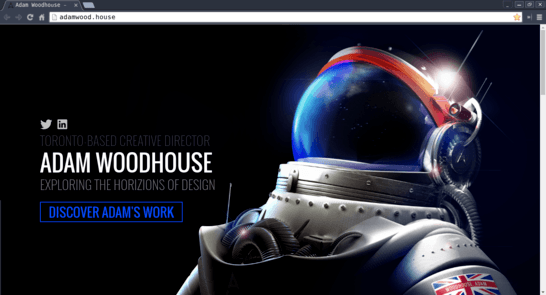
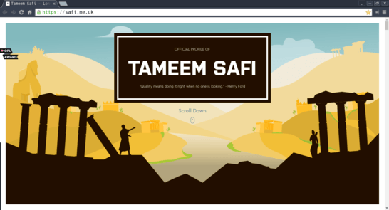

# Creating Our Own Personal Website

## Objectives

- ▢ Menggunakan berbagai ilmu pengembangan web yang sudah didapat.
- ▢ Mengolah potensi kreatifitas yang ada dalam diri.
- ▢ Menggambarkan pemahaman desain web dan pengalaman pengguna.
- ▢ Berlatih mengimplementasikan proses pembuatan website lebih baik.

## Directions

### 1. Pelajari lebih dalam tentang desain web dan tools yang tersedia

Cukup sekilas untuk mengetahui dan mempelajari gambaran umumnya dari berbagai referensi berikut.

**Design**

- ▢ [A Design Primer for Engineers, by Rands in Repose](http://randsinrepose.com/archives/a-design-primer-for-engineers)
- ▢ [Straight-Up Design, slide by Jen Myers](https://speakerdeck.com/jenmyers/straight-up-design)
- ▢ [How Developers Can Help Designers, by Matt Gemmell](http://mattgemmell.com/how-developers-can-help-designers)
- ▢ [Solving design problems on Ubuntu Design](http://design.canonical.com/2012/11/solving-design-problems)
- ▢ [Design Principles FTW](http://www.designprinciplesftw.com) (Awas, sangat banyak referensi yang ditawarkan di sini)

**User Interface**

- ▢ [10 User Interface Design Fundamentals on Treehouse](http://blog.teamtreehouse.com/10-user-interface-design-fundamentals)
- ▢ [GoodUI: User Interface Ideas](http://goodui.org)

**User Experience**

- ▢ [What Is User Experience Design? Overview, Tools And Resources by Jacob Gube on Smashing Magazine](https://www.smashingmagazine.com/2010/10/what-is-user-experience-design-overview-tools-and-resources)

**Web Design**

- ▢ [6 Phases of the Web Site Design and Development Process, by Selene M. Bowlby on iDesign Studios](http://www.idesignstudios.com/blog/web-design/phases-web-design-development-process)
- ▢ The Principles of Good Web Design by Tom Kenny Design
  - ▢ [Part 1: Layout](http://tomkenny.design/articles/the-principles-of-good-web-design-part-1-layout)
  - ▢ [Part 2: Navigation](http://tomkenny.design/articles/the-principles-of-good-web-design-part-2-navigation)
  - ▢ [Part 3: Colour](http://tomkenny.design/articles/the-principles-of-good-web-design-part-3-colour)
  - ▢ [Part 4: Content](http://tomkenny.design/articles/the-principles-of-good-web-design-part-4-content)

**Design Tools**

- ▢ [Wireframe.cc](https://wireframe.cc)
- ▢ [Moqups](https://moqups.com)
- ▢ [Balsamiq](https://balsamiq.com)
- ▢ [UXPin](https://www.uxpin.com)
- ▢ [Marvel](https://marvelapp.com)
- ▢ [Google Web Fonts](http://google.com/fonts)
- ▢ [Colour Lovers](http://colourlovers.com)

### 2. Dapatkan inspirasi dari orang lain

Berikut berbagai contoh dan inspirasi personal website.

**[Adam Woodhouse](http://adamwood.house)**

**[Tameem Safi](https://safi.me.uk)**

**[Nathan Riley](http://nrly.co)**

**[Joe Dawson](http://joedawson.me)**

**[Sławomir Mazur](http://stricte.io)**

### 3. Rancanglah website pribadi kamu

Tiba saatnya dalam hal favorit yang paling dinantikan oleh semua web developer: membuat website untuk pribadi! Beberapa orang melakukannya sebagai hobi yang seru, karena kita bisa mengekspresikan diri sekaligus bereksperimen dengan berbagai teknologi web. Sertakan minimal nama dan hal-hal favoritmu! Kreasikan dirimu. Buat ulang website kamu yang terdapat di `[USERNAME].github.io` dengan lebih baik. Ingat juga untuk link semua halaman hasil aktivitas buatanmu.

- ▢ Rencanakan bentuk website baru kamu. Tulis sebuah rencana kemudian push detail tersebut ke GitHub.
- ▢ Buatlah wireframe website kamu. Gunakan tools yang kamu prefer.
- ▢ Kumpulkan berbagai media yang diperlukan. Gambar atau video, kemudian taruh di repositori atau bisa juga upload ke layanan berbagi gambar atau video seperti imgur atau YouTube.
- ▢ Implementasikan rencana dan wireframe. Code website kamu dengan HTML, CSS, dan JavaScript.
- ▢ Susun kumpulan media yang ada ke halaman web kamu.
- ▢ Pastikan semua source code sudah di-push ke GitHub.

## References

- Temukan lebih banyak inspirasi di [One Page Love](https://onepagelove.com)
