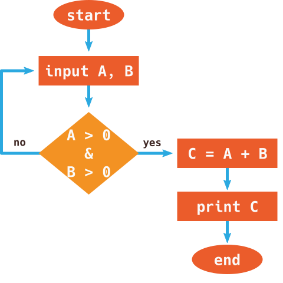

# Learn Algorithm and Pseudocode

## Objectives

- ▢ Memahami struktur alur program dengan algoritma dan pseudocode

## Directions

### Mengenal Algoritma

Belajar pemrograman tentu saja memerlukan banyak berpikir secara logika, sehingga kita bisa memecahkan masalah atau melakukan kegiatan yang kita targetkan. Agar kita bisa menjelaskan alur logika kita, perlu digunakan algoritma.

Namun apa itu algoritma? Mari kita ilustrasikan terlebih dahulu.

Bagaimana cara kamu menggunakan komputer sehari-hari? Mulai dari menekan tombol on/off, menunggu proses booting, memasukkan password, membuka aplikasi yang dibutuhkan, kemudian bekerja sesuai aplikasi tersebut. Atau lain lagi, bagaimana cara menggunakan smartphone? Cukup unlock dari posisi standby, lalu pilih dan buka aplikasi yang dibutuhkan, dan seterusnya.

Nah itulah algoritma, kumpulan proses ataupun aturan untuk melakukan atau menyelesaikan sesuatu. Sesuatu ini biasanya berupa masalah atau kegiatan yang langkah-langkahnya pasti terbatas (tidak terus-menerus).

Dalam menggunakan bahasa pemrograman, kita bisa menggunakan atau bahkan tidak perlu menggunakan algoritma. Tapi hampir 99% pastinya perlu algoritma. Misalnya saja kita sudah tahu algoritma dasar dari perulangan dan perkondisian.

Algoritma bisa sesederhana kita jabarkan langkah-langkahnya seperti tadi, atau kita visualisasikan dalam bentuk flowchart seperti berikut.



### Mengenal Pseudocode

Atau agar lebih rapi, kita gunakan pseudocode. Psedudocode adalah konvensi terstruktur atau cara menyajikan penjelasan algoritma dengan bahasa yang deskriptif seperti kita menulis kalimat biasa sehingga mudah kita baca. Umumnya digunakan bahasa Inggris atau bahasa perantara yang mirip bahasa pemrograman. Lihatlah contoh algoritma penambahan angka sederhana dengan pseudocode berikut.

**Bahasa Indonesia**

```
BACA dan SIMPAN "angka pertama"
BACA dan SIMPAN "angka kedua"
HITUNG "angka pertama" ditambah "angka kedua"
SIMPAN hasil hitungan sebelumnya
TAMPILKAN hasil hitungan
```

**Bahasa Inggris**

```
READ and SAVE "first number"
READ and SAVE "second number"
COMPUTE "first number" added by "second number"
SAVE previous computation result
SHOW the computation result
```

**JavaScript**

```
var a,b,c;
a = prompt("First Number?");
b = prompt("Second Number?");
c = Number(a) + Number(b);
console.log(c);
alert("Result = " + c);
```

Dengan begini, kita bisa menjelaskan proses atau alur logika tanpa bahasa pemrograman tertentu. Sehingga juga logika yang sama bisa ditransfer atau diterapkan ke bahasa pemrograman lain. Misalnya...

**Python**

```
a = input("First Number? ")
b = input("Second Number? ")
c = int(a) + int(b)
print("Result", c)
```

**Ruby**

```
puts "First Number?"
a = gets.chomp
puts "Second Number?"
b = gets.chomp
c = a.to_i + b.to_i
puts c
```

### References

-
