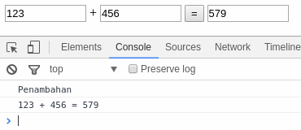
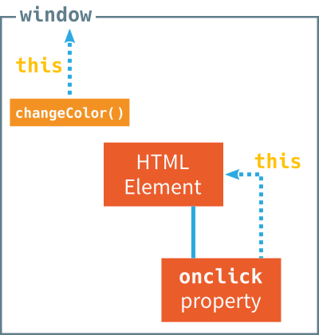

# Learn JavaScript Events

## Objectives

- ▢ Mengenal events secara umum dan secara object.
- ▢ Mengenal keyword `this`.
- ▢ Mengelola events dengan model event handler ataupun listener.

## Directions

### Mengenal events

Events atau kejadian merupakan sinyal dari browser untuk menandakan bahwa sesuatu sedang terjadi. Misalnya event/sinyal saat suatu tombol keyboard ditekan, mouse diklik, mouse sedang hover ke sebuah elemen, dan lain-lain. Kebanyakan aplikasi di browser melakukan sesuatu/aksi karena respon terhadap event.

Ada beberapa tipe event:

- event pada DOM yang diinisiasi oleh element DOM, seperti click dan mouseover
- event pada window, seperti resize dan minimize windows
- event lainnya, seperti load dan state ready

Setiap mengatur event, kita akan gunakan function yang akan dipanggil terhadap event tersebut. Function ini disebut event handler. Penamaan function-nya biasanya berpola `onEventName` seperti `onclick` dan `onchange`.

Penggunaan dasarnya seringkali ada pada HTML tag...

```html
<button onclick="document.write('<p>Cleared.</p>');">Clear!</button>
```

Dengan event yang kita pasang di dalam form, lalu adanya function JavaScript yang dipanggil saat ada event click, kita bisa membuat kalkulator sederhana yang lebih ramah pengguna.

```html
<form name="addition">
  <input name="firstNumber" type="number">
  <span>+</span>
  <input name="secondNumber" type="number">
  <input name="addButton" type="button" value="=" onclick="addNumbers()">
  <input name="result" type="number" value="">
</form>
```

```html
<script type="text/javascript">
  function addNumbers() {
    console.log(`Penambahan`);
    var form = document.forms.addition;
    var x = form.elements.firstNumber.value;
    var y = form.elements.secondNumber.value;
    var z = Number(x) + Number(y);
    console.log(`${x} + ${y} = ${z}`);
    form.elements.result.value = z;
  }
</script>
```



### Keyword Istimewa: `this`

`this` merupakan keyword atau referensi yang menunjukkan "sesuatu" dimana `this` tersebut dideklarasikan. Misalnya `this` dipanggil dalam element `div`, berarti `this`-nya adalah element `div` tersebut.



dapat digunakan seperti...

```html
<button onclick="console.log(this.innerHTML)">Konten</button>
```

atau jika dikombinasikan dengan function...

```html
<button id="example">Example</button>
```

```javascript
document.getElementById("example").onclick = function() {
  this.style.color = "#8470FF";
  this.style.fontSize = "14px";
  this.style.padding = "10px";
};
```

Kita akan gunakan `this` ini lebih banyak ketika kita sudah memahami konsep scope lebih lanjut.

### Modern Event Handler/Listener Model

Cara membuat dan menggunakan event handler sebelumnya masih bisa dipakai, tapi sebaiknya mulai dihindari. Bahkan repot juga kalau harus menempatkan beberapa event handler di dalam suatu elemen. Pada masa modern ini, kita bisa saja memiliki berbagai library atau framework yang memudahkan kita. Namun kita juga perlu pikirkan bagaimana kode kita dan mereka dapat bekerja sama dengan baik, terutama saat kita perlu memasang lebih dari satu event handling pada element atau node yang sama. Untuk itu kita gunakan `addEventListener()` yang bisa mengatasi masalah tersebut. Mirip dengan handler, namun listener lebih memberi kemampuan yang aktif untuk mengelola event. Kedua istilah ini bisa saja digunakan bergantian.

- assign event: `element.addEventListener(event, handler, phase)`
- remove event: `element.removeEventListener(event, handler, phase)`

Dengan listener juga, tidak pakai embel-embel `on` seperti `onclick`, jadi langsung `click` saja.

```html
<button id="example">Example</button>
```

```javascript
function changeColor() {
  this.style.color= "#8470FF";
}
function logMessage() {
  console.log("Message");
}
var elem = document.getElementById("example");
elem.addEventListener("click", changeColor, false);
elem.addEventListener("click", logMessage, false);
```

### Objek Event

Hebatnya di JavaScript adalah, bahkan sebuah event merupakan object juga. Tentu secara tersirat kita telah ketahui ini pada saat menggunakan event handler dan listener.

Mengambil object event biasanya dilakukan dengan pola seperti...

```javascript
document.getElementById("eventExample").addEventListener("click", logEvent, false);

function logEvent(event) {
  console.log(event);
};
```

Objek event memilki berbagai property yang bisa kita gunakan seperti `target`, `currentTarget`, `type`, `view`, `defaultPrevented`, dll.

Salah satu method paling digunakan pada objek event adalah `preventDefault()` dimana dengan ini kita bisa mencegah browser melalukan aksi default/normal terkait dengan respon pada event. Misalnya di sini mencegah agar anchor tidak dapat berfungsi.

```html
<a id="example" href="http://example.com">Example</a>
```

```javascript
document.getElementById("example").addEventListener("click", function(e){
  e.preventDefault()
});
```

Gunanya untuk apa? Bisa saja ke depan kita ingin membuat menimpa sifat bawaan dari browser atau perlu membuat custom behavior (sifat) pada sebuah elemen. Misalnya saat kita klik kanan di suatu elemen, kita bisa melakukan aksi lain.

**Catatan Penting:** Jika ingin menggunakan event listener yang memanggil sebuah fungsi, deklarasikan terlebih dahulu fungsi tersebut sebelum memasang event listener terhadap elemen.

### References

- [JavaScript: Events and Listeners, on I'd Rather Be Writing](http://idratherbewriting.com/events-and-listeners-javascript)
- [JavaScript Events, on W3Schools](http://www.w3schools.com/js/js_events.asp)
- [DevDocs DOM Event API Documentation](http://devdocs.io/dom_events)
